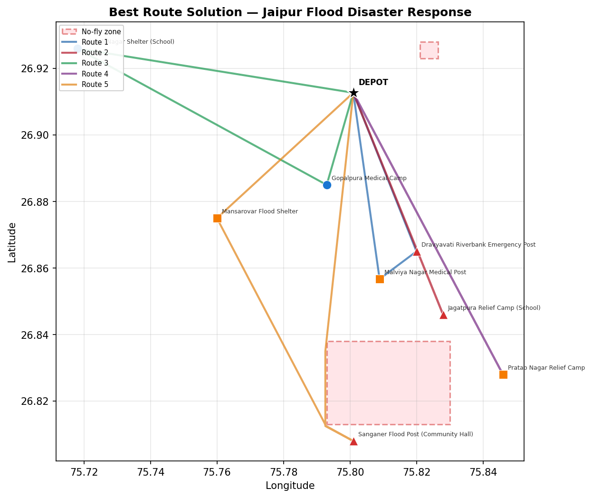
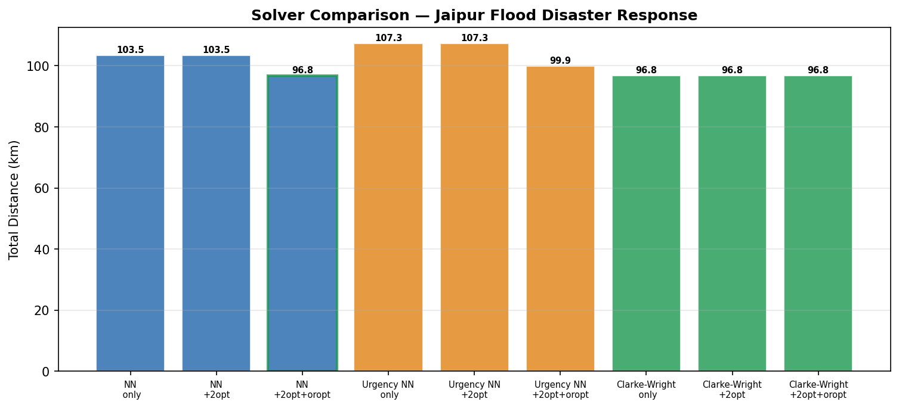

# Med-Drone Mission Control

**Autonomous Fleet Routing & Dynamic Replanning for Disaster Logistics**

An operations research and autonomous mission control testbed designed for emergency medical drone delivery in disaster-affected areas. When catastrophic flooding, earthquakes, or infrastructure collapses sever surface road networks, this system orchestrates a fleet of multi-rotor drones to transport critical medical supplies—vaccines, blood units, antivenom, and emergency medicine—from hospital depots to stranded clinics and relief camps under strict physical and operational constraints.

<p align="center">
  
</p>
<p align="center">
  <em>Multi-drone fleet routing across flooded Jaipur with A* detours around restricted airspace.</em>
</p>

---

## Core Technical Highlights

The platform integrates operations research, computational geometry, discrete-event simulation, and computer vision into an integrated mission architecture:

- **From-Scratch Multi-Heuristic CVRP Solver**: Implements three independent construction heuristics (Nearest Neighbor, Urgency-Weighted Nearest Neighbor, and Clarke-Wright Savings) with intra-route 2-opt and inter-route Or-opt relocate operators. Evaluates all candidates and selects the best feasible solution found across multiple construction heuristics and local-search passes.
- **Simultaneous Multi-Constraint Routing**: Jointly enforces vehicle payload capacity, flight range energy budgets (with reserve margins), cumulative cold-chain thermal decay limits, and strict delivery deadline time windows.
- **NFZ/TFR-Aware A\* Pathfinding**: Automatically routes around polygon no-fly zones and pop-up Temporary Flight Restrictions. Uses conservative axis-aligned bounding box (AABB) pre-filtering, 8-connected grid search, corner-cutting prevention, and bidirectional string-pulling path smoothing.
- **50 m Safety-Clearance Enforcement**: Enforces a configured 50-meter safety margin around all obstacle edges. Automatically scales cell diagonal compensation when large search areas trigger grid coarsening under `MAX_CELLS = 120`.
- **Sub-Second Dynamic Replanning**: Injects mid-mission disruptions (pop-up TFRs, urgent medical requests, drone motor failures) and re-solves remaining stops from live airborne GPS positions and remaining cargo/range budgets in approximately **0.20–0.26 s** (8 stops) to **0.61–0.79 s** (15 stops) on the tested machine.
- **Physical Infeasibility Diagnosis**: Immediately catches and diagnoses physically impossible missions (e.g. destinations exceeding round-trip battery range or locations trapped inside restricted airspace) before dispatch.
- **Multi-Drone Discrete-Event Fleet Simulator**: Simulates time-stepped fleet execution with realistic vehicle state machines (`IDLE`, `DISPATCHED`, `TRANSIT`, `DELIVERING`, `RETURNING`, `CHARGING`, `HOLD`), physical depot departures, and live telemetry logging.
- **MAVLink / QGroundControl WPL 110 Export**: Generates industry-standard mission files compatible with ArduPilot and PX4 autopilots, embedding intermediate detour waypoints and payload delivery hover/dwell times.
- **Computer Vision Landing Zone Screening**: Integrates YOLOv8 obstruction screening to verify landing pad safety (detecting people, vehicles, and debris) prior to descent.
- **OR-Tools Benchmarking**: Provides a comparative baseline for capacity- and range-constrained routing against Google OR-Tools on identical distance matrices.
- **Exhaustive Automated Testing & CI**: Includes 94 automated tests covering geometry, routing heuristics, constraints, simulation mechanics, and export formats, verified on GitHub Actions CI.

<p align="center">
  
</p>
<p align="center">
  <em>Heuristic benchmark comparison — the multi-start pipeline balances route quality and computational overhead.</em>
</p>

---

## Dynamic Replanning & Measured Performance

Traditional routing systems treat pre-flight plans as static commitments. When unexpected disruptions occur mid-flight, Med-Drone Mission Control replans dynamically:

1. **Airborne State Propagation**: Active drones do not reset to depot; they are treated as dynamic moving origins initialized with their live GPS coordinates, remaining battery range budget, and onboard payload.
2. **Emergency Cargo Dispatch**: Newly injected urgent requests originate physically from the depot; idle drones dispatch immediately, or requests queue until a vehicle returns.
3. **Pop-Up TFR Handling**: If a flight corridor is abruptly closed by an emergency airspace restriction, affected drones immediately compute an A* escape vector and reroute around the perimeter.
4. **Failure Redistribution**: If a drone suffers motor failure, its undelivered stops are reassigned across the remaining healthy fleet.

### Measured Empirical Benchmarks

These timings represent measured benchmark results on the tested machine (Apple Silicon Mac, M-series, Python 3.10+) across the specified scenarios, demonstrating sub-second response across cold-cache and warm-cache runs:

- **8-Stop Replan** (Jaipur Disaster): approximately **0.20–0.26 s** (~201 ms warm cache, ~254 ms cold cache)
- **15-Stop Replan** (Multi-obstacle random clusters): approximately **0.61–0.79 s** (~617 ms warm cache, ~801 ms cold cache)
- **Distance Matrix Construction**: ~200–258 ms (Jaipur, 18 detours), ~206–280 ms (Chennai, 12 detours)

| Operation | Scenario / Scale | Cold Cache (Mean) | Warm Cache (Mean) |
| :--- | :--- | :---: | :---: |
| **Flight Distance Matrix** | Jaipur Disaster (9 locs, 18 detours) | ~258 ms | ~202 ms (min: ~200 ms) |
| **Flight Distance Matrix** | Chennai Flood (8 locs, 12 detours) | ~280 ms | ~206 ms (min: ~205 ms) |
| **8-Stop Dynamic Replan** | Jaipur Disaster (8 deliveries, 2 NFZs) | ~254 ms | ~201 ms (min: ~200 ms) |
| **15-Stop Dynamic Replan** | Multi-Obstacle Clusters (5 seeds) | ~801 ms | ~617 ms (min: ~91 ms) |

For the tested 8–15-stop scenarios, full replanning remains sub-second to low-second (~0.20–0.26 s for 8 stops, ~0.61–0.79 s for 15 stops on the tested machine), eliminating the need for complex partial-graph repair heuristics.

To reproduce these benchmarks on your machine:
```bash
python3 benchmarks/benchmark_replanning.py
```

---

## Architecture

```
config.py              → Scenario definition: depot, delivery stops, polygon NFZs, drone parameters
   ↓
distance_matrix.py     → Flight distance matrix (straight-line + A* detour paths)
+ nofly_astar.py       → 8-connected grid A* with AABB filtering, corner-cutting blocks, string-pulling
   ↓
vrp_scratch.py         → Clarke-Wright + Nearest-Neighbor + Urgency-NN → 2-opt → Or-opt
   ↓
cold_chain.py          → Cumulative refrigeration exposure verification
time_windows.py        → Urgent and scheduled delivery deadline evaluation
yolo_safety.py         → Landing site visual obstruction screening (YOLOv8)
   ↓
waypoint_export.py     → MAVLink QGroundControl WPL 110 mission export for ArduPilot/PX4
```

**Real-Time Simulation & Execution Layer:**
```
simulate_fleet.py      → Discrete-event fleet engine with vehicle state machines
   ↓
replan.py              → Dynamic mid-flight re-solver from live GPS coordinates
   ↓
build_interactive_sim.py → Standalone Leaflet.js mission replay visualizer
```

---

## Quick Start

The core engine is built entirely with the Python standard library—**zero third-party dependencies required** to run the routing pipeline, replanner, test suite, and benchmarks.

```bash
git clone https://github.com/Atharv-Garg446/Med-Drone-Mission-Control.git
cd Med-Drone-Mission-Control

# Run the core routing pipeline (pure standard library)
python3 main.py --no-osmnx

# Run discrete-event fleet simulation with disruptions
python3 run_simulation.py --events 5
# Open the generated interactive playback: http://localhost:8080/output/interactive_sim.html

# Run the reproducible replanning and A* benchmark suite
python3 benchmarks/benchmark_replanning.py

# Run all 94 automated tests
python3 -m unittest discover -s tests -p "test_*.py" -v
```

### Optional Dependencies

For expanded visualization, benchmarking, and vision screening:

```bash
pip install -r requirements.txt
```

| Dependency | Purpose |
|---|---|
| `folium` | Generates interactive browser route maps (`visualize_map.py`) |
| `ortools` | Google OR-Tools comparative routing baseline (`vrp_ortools.py`) |
| `ultralytics` | YOLOv8 landing zone obstruction detection (`yolo_safety.py`) |
| `matplotlib` | Static publication-grade route and convergence plots (`plots.py`) |
| `streamlit` | Interactive web dashboard (`dashboard.py`) |
| `osmnx` | Optional surface road network distance comparison (`distance_matrix.py`) |

---

## Built-in Operational Scenarios

The system ships with calibrated disaster scenarios modeled after real-world events:

- **Jaipur Flood Disaster Response**: Monsoon flooding along the Dravyavati River basin. SMS Hospital serves as the central elevated depot; 8 delivery locations distribute antivenom, blood, and emergency packs across flooded relief camps around Jaipur Airport and Secretariat no-fly zones.
- **Chennai Cyclone Response**: Modeled after historic South Indian coastal flooding. Rajiv Gandhi Government General Hospital acts as depot, distributing medical supplies across 7 submerged southern medical posts while navigating Chennai Airport and Guindy National Park airspace.
- **Jaipur Hospital Network (Routine)**: Demonstrates system versatility on routine daily restock operations under normal flight conditions.

### Arbitrary Geographies

Any GPS location can be targeted dynamically:
```bash
python3 main.py --random-at 40.7580 -73.9855      # Manhattan, NY
python3 main.py --random-at 35.6586 139.7454       # Tokyo, Japan
python3 main.py --from-json custom_mission.json    # User-defined mission JSON
```

---

## Autopilot & Ground Control Station Integration

The mission planner exports navigation plans directly to **QGroundControl WPL 110** format, the standard waypoint format used by ArduPilot and PX4 autopilots:

1. Execute `python3 main.py --no-osmnx` to generate route missions in `output/`.
2. Open **QGroundControl** $\to$ **Plan** $\to$ **File** $\to$ **Load**.
3. Upload to an ArduPilot SITL simulator or physical flight controller.

Exported plans include computed A* detour waypoints and dwell hover commands (`MAV_CMD_NAV_LOITER_TIME`) at delivery coordinates. (Note: WPL 110 controls navigation flight plans; physical winch or servo drops require vehicle-specific payload triggers).

---

## Engineering Boundaries & Operational Scope

Med-Drone Mission Control is an algorithmic testbed and simulation prototype. Operational deployment requires noting specific scope boundaries:

- **Range Energy Model**: Employs a distance-and-reserve model (Haversine distance with configured reserve percentage) rather than multi-cell electrochemical battery models, temperature-dependent discharge curves, dynamic wind vectors, or payload mass-adjusted drag profiles.
- **Airspace Regulation**: No-fly zones and pop-up TFRs are modeled as 2D polygonal spatial barriers on local grids, rather than live UTM/U-Space feeds or dynamic civil aviation NOTAM broadcasts.
- **OR-Tools Baseline Scope**: Serves as a comparative baseline for capacity- and range-constrained routing; it does not model the custom cumulative cold-chain exposure limits or time-window urgency discounts implemented in the primary solver.
- **Landing Vision Verification**: Pretrained YOLOv8 provides aerial scene screening; it is an algorithmic safety screen rather than certified dual-redundant landing sensor fusion.
- **MAVLink Mission Scope**: Produces navigation mission waypoints with site hover delays; it does not actuate hardware release solenoids.

---

## Testing & Quality Assurance

```bash
python3 -m unittest discover -s tests -p "test_*.py" -v
```

The test suite consists of **94 automated tests using Python's standard-library unittest framework**:
- **Geometry & Spherical Math**: Haversine distances, ray-casting point-in-polygon parity, segment-to-polygon distance, AABB pre-filtering equivalence.
- **A\* Pathfinding & Airspace Safety**: Obstacle avoidance, corner-cutting block enforcement, 50 m safety-clearance enforcement, `MAX_CELLS` coarsened grid handling, pop-up TFR escape vectors, dead-edge detection.
- **Routing Heuristics & Local Search**: Nearest-Neighbor, Clarke-Wright Savings, Urgency NN, 2-opt segment reversals, Or-opt relocate operators.
- **Hard Operational Constraints**: Cumulative cold-chain exposure, delivery deadline windows, payload capacity, return-to-base range bounds, infeasibility validation.
- **Fleet Simulation & Replanning**: Discrete-event mission execution, state transitions, dynamic mid-air replanning, disruption response.
- **Mission Export & Vision**: QGC WPL 110 format syntax, dwell times, YOLO threat prioritization and noise suppression.

All commits are continuously validated on GitHub Actions across Python 3.10, 3.11, and 3.12.

---

## License

MIT License. See [LICENSE](LICENSE) for details.
